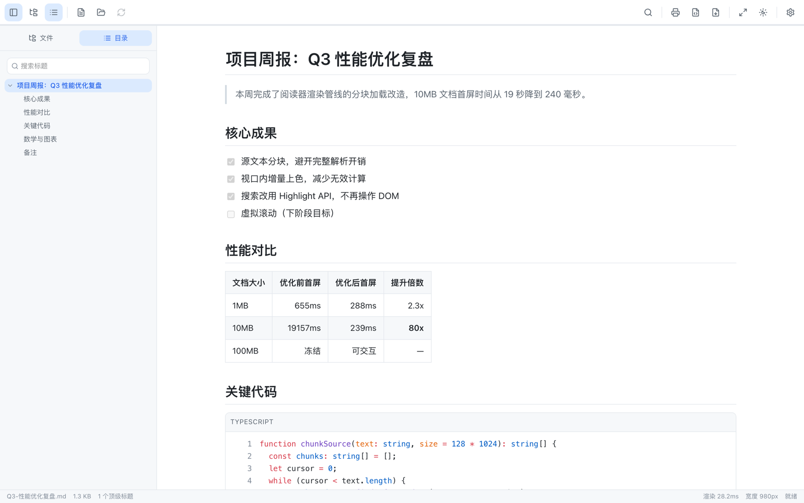
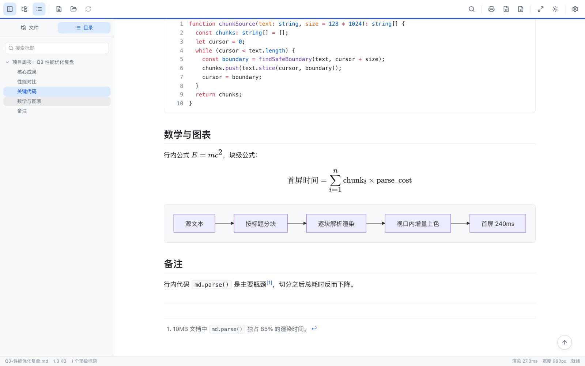
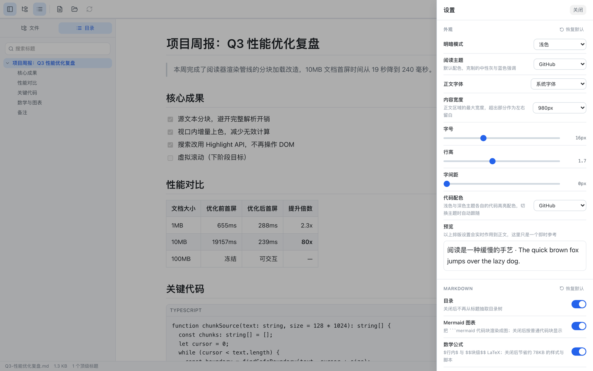
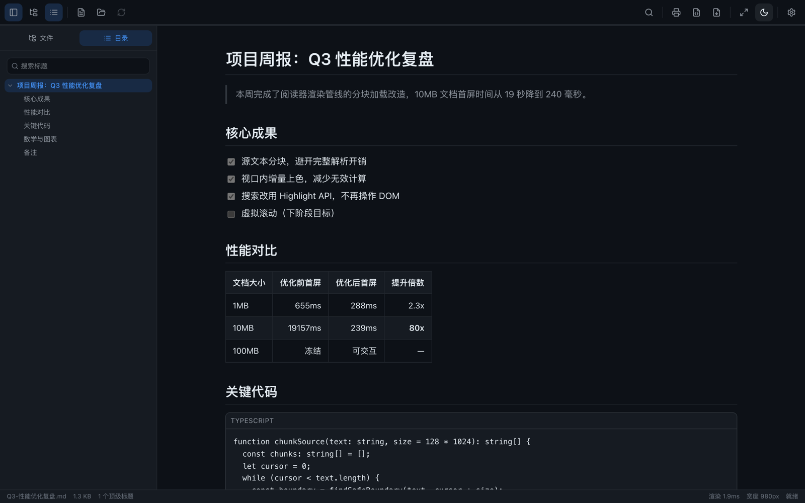

<div align="center">


# Markdown Reader

**一款只做一件事的浏览器扩展：把 Markdown 文件变得好看、好读。**

不联网、不上传、不注册——文件全程留在你自己的电脑上。

</div>

<br />



<br />

## 这是做什么的

平时打开一份 `.md` 文件（比如项目里的 `README.md`、笔记软件导出的文档），浏览器要么直接显示成一堆夹杂 `#` 和 `**` 符号的纯文本，要么得专门开个编辑器才能看。

装上 Markdown Reader 之后，浏览器打开的每一份 `.md` 文件都会自动变成一篇排版整齐的文章：标题分级清楚、代码带语法高亮、表格对齐、图表能画出来——而且**全程在本地完成，不产生任何网络请求**，你的文件内容不会离开这台电脑。

## 主要功能

| | |
| --- | --- |
| 📖 **完整渲染** | 表格、任务清单 `- [x]`、脚注、上下标、高亮 `==文字==` 等 GitHub 风格 Markdown 语法全支持 |
| 🎨 **代码高亮** | 200 多种编程语言，颜色自动跟随浅色 / 深色模式切换 |
| 📊 **图表与公式** | 写 ` ```mermaid ` 代码块自动画成流程图，`$E=mc^2$` 自动渲成数学公式 |
| 📑 **自动目录** | 侧栏按标题自动生成目录树，滚动阅读时同步高亮当前章节 |
| 📂 **同目录跳转** | 打开一份文档，侧栏自动列出它所在文件夹里的其他 `.md`，点一下就切换 |
| 🔍 **全文查找** | `Ctrl/Cmd + F` 呼出查找框，支持上一条 / 下一条跳转与命中计数 |
| 🔄 **自动刷新** | 用别的编辑器改完文件保存，页面自动重新渲染，阅读位置不会跳动 |
| 📤 **随时导出** | 一键导出成独立 HTML 网页、整理过的 Markdown 文件，或打印成 PDF |
| 🖌️ **四套主题** | 内置四种阅读配色，正文宽度、字号、行距均可调，也支持写自定义 CSS |
| 🔒 **零数据收集** | 不发起任何网络请求，所有设置只存在你自己的浏览器里 |

## 安装

商店上架前，需要从源码构建后手动加载，全程不到两分钟（需要先装好 [Node.js](https://nodejs.org/)）。

1. 下载本仓库源码，在项目目录下执行：
   ```bash
   npm install
   npm run build
   ```
   构建产物会生成在 `dist/` 文件夹里
2. 浏览器地址栏输入 `chrome://extensions`，打开右上角的「开发者模式」
3. 点击「加载已解压的扩展程序」，选中 `dist/` 文件夹
4. 工具栏出现 Markdown Reader 的图标即安装完成

> 想直接双击本地 `.md` 文件也能自动打开阅读器？请看下面「在浏览器里直接打开」一节，需要额外开启一个权限开关。

## 使用方法

### 方式一：点工具栏图标

点击浏览器工具栏上的图标 → 「打开文件」，选中一份 `.md` 文件即可。

### 方式二：直接拖拽

把 `.md` 文件从文件夹里拖进阅读器窗口，松手就渲染。

### 方式三：在浏览器里直接打开 `.md`（推荐）

装好扩展后，双击本地 `.md` 文件，或者在地址栏访问一个 `.md` 地址，页面会**自动被阅读器接管**，地址栏保持不变——带着 `#标题` 打开还会自动跳到对应章节。

本地文件需要额外授权一次：`chrome://extensions` → 找到本扩展 → 打开「允许访问文件网址」。不想要这个行为，可以在「设置 → 高级」里关掉。

<br />



<p align="center"><sub>写在 Markdown 里的代码块、公式和 Mermaid 图表，打开即所见即所得</sub></p>

<br />

## 个性化设置

点右上角齿轮图标打开设置面板：明暗模式、阅读主题、正文宽度、字号行距字间距，改动都是实时生效，不用刷新页面。



深色模式下代码高亮、图表配色都会跟着自动换一套配色，不会出现刺眼的白底代码块：



## 常见问题

**为什么双击 `.md` 文件没有变成阅读器界面？**
检查 `chrome://extensions` 里是否开启了「允许访问文件网址」；这是浏览器本身对本地文件访问的限制，扩展没有这个权限就读不到文件内容。

**打开的是下载对话框，不是阅读器？**
个别网站给 `.md` 文件加了强制下载的响应头，浏览器会直接下载而不打开页面。这种情况用工具栏的「打开文件」手动选择下载好的文件即可正常阅读。

**我的文件内容会被上传吗？**
不会。这个扩展不包含任何网络请求代码，也不会向任何服务器发送数据。所有设置和阅读记录只保存在你自己的浏览器本地存储里。

**支持 Windows / Mac 吗？**
支持所有安装了 Chrome 或其他 Chromium 内核浏览器（Edge、Brave 等）的系统。

## 反馈

用着有问题，或者想要什么功能，欢迎提 [Issue](https://github.com/suyue1000/md-reader/issues)。
