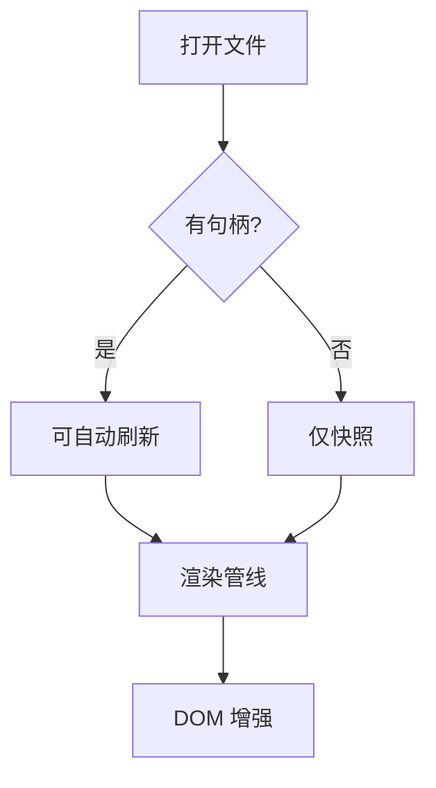

# Markdown Reader 渲染测试

这是一份用于**手工验证**渲染管线的样例文档，覆盖了 Phase 2 支持的全部语法。

## 一、行内语法

支持 **粗体**、*斜体*、~~删除线~~、==高亮==、`行内代码`、H~2~O 下标与 x^2^ 上标。

自动链接：https://example.com ，普通链接：[Anthropic](https://www.anthropic.com)。

Emoji 短代码：:rocket: :smile: :warning:

脚注引用[^perf]，以及另一个脚注[^mem]。

[^perf]: 点光源会让被照到的角色多渲染一遍，Tri 与 DC 双双翻倍。
[^mem]: 音乐只占内存，不影响渲染。

## 二、列表

### 任务列表

- [x] 实现 markdown-it 渲染管线
- [x] 接入 Shiki 语法高亮
- [ ] 目录树（Phase 3）
- [ ] 自动刷新（Phase 6）

### 嵌套列表

1. 第一层
   1. 第二层
      - 第三层
      - 另一项
2. 回到第一层

### 定义列表

Tri
: 三角形数，衡量几何复杂度的指标。

DC
: Draw Call，每帧提交给 GPU 的绘制命令数量。

## 三、表格

| 素材            | 单位开销      | DC       | 建议范围（移动端）   |
| --------------- | ------------- | -------- | -------------------- |
| 角色（高模）    | 15K–35K Tri   | 6–8 DC   | ≤ 8K–12K Tri、1–2 DC |
| 场景/舞台       | 15K–140K Tri  | 10–40 DC | ≤ 30K–60K Tri        |
| 灯光·点光源     | 每盏 +~87K Tri | +~20 DC  | 不建议用真实动态光   |
| 音乐            | 0 Tri / 0 DC  | 0        | 不影响渲染           |

## 四、引用

> 一句话：点光源把整批角色重复渲染了好几遍，Tri 和 DC 双双翻倍；
> 光斑与光柱几乎零成本。

## 五、代码块

### TypeScript

```ts
/** 按层级折叠标题，处理跳级与回退 */
export function buildTocTree(headings: readonly FlatHeading[]): TocNode[] {
  const root: TocNode[] = [];
  const stack: TocNode[] = [];

  for (const heading of headings) {
    const node: TocNode = { ...heading, children: [] };
    while (stack.length > 0 && (stack.at(-1)?.level ?? 0) >= node.level) {
      stack.pop();
    }
    (stack.at(-1)?.children ?? root).push(node);
    stack.push(node);
  }

  return root;
}
```

### CSS

```css
.markdown-body .code-block.is-numbered .code-block__pre .line::before {
  counter-increment: shiki-line;
  content: counter(shiki-line);
  color: var(--app-text-subtle);
}
```

### 无语言标注

```
纯文本代码块，不做语法高亮。
第二行。
```

## 六、数学公式

行内公式：质能方程 $E = mc^2$，以及 $\sum_{i=1}^{n} i = \frac{n(n+1)}{2}$。

块级公式：

$$
\int_{-\infty}^{\infty} e^{-x^2}\,dx = \sqrt{\pi}
$$

## 七、Mermaid 图表



## 八、图片与分隔线

> 注意：markdown-it 出于安全考虑只放行 `data:image/gif|png|jpeg|webp`，
> SVG 的 data URL 会被拒绝（SVG 里可以藏脚本），因此这里用 PNG。


---

## 九、重复标题测试

内容 A。

## 九、重复标题测试

内容 B —— 这个标题的锚点应该自动追加序号。
